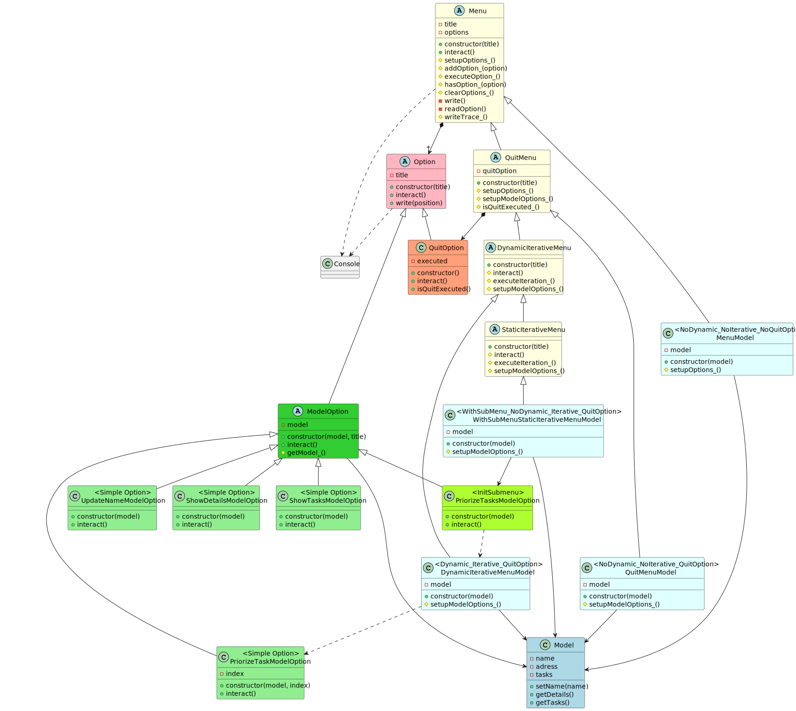

# Menu

## Versions
* [Example](#example)

## Example
Menus implemented with inheritance. Dessign goal is <b>maximize reusable code</b> .

1. Model Menu: after one model's option is executed the menu ends.
2. Quit Menu: model Menu, but also has the Quit Option (don't colaborate with model).
3. Static Iterative Menu:  quit menu, but after one model's option is executed the menu offers again it's options. Only ends when the Quit Option is selected.
4. Dynamic Iterative Menu: iterative menu like Static, but options offered in each iteration can change. Quit option remains always.
5. X Menu with submenu: iterative menu, but one option implies init other (sub)menu. When the submenu ends this menu continues.

